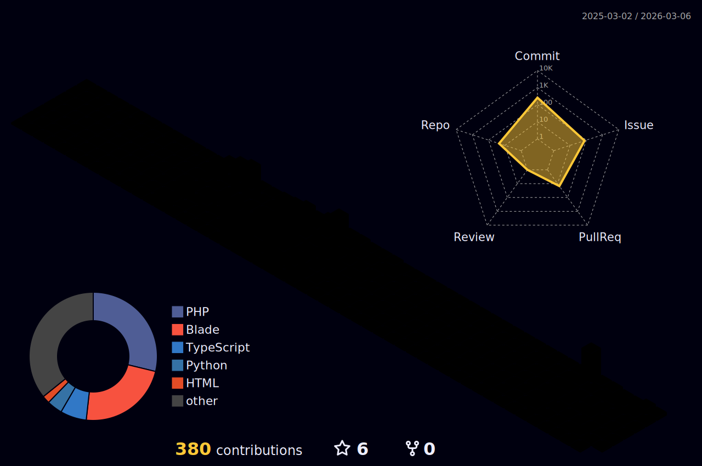

<h1 align="center">Hi 👋, I'm Yoshiki Yokoyama</h1>
<h2 align="center">👨‍💻Backend developer from Japan</h2>

  

<h2 align="left">📊 Profile Summary Cards:</h2>

  
   
  
  
   
  
  
   
  

 

<h2 align="left">🔧Languages and Tools:</h2>

 
  <h4>Programming Languages<h4>
   
   
   

  <h4>Frontend Development<h4>
   
   
    <a href="https://getbootstrap.com" target="_blank" rel="noreferrer"> 
     
  

  <h4>Backend Development<h4>
  

  <h4>Database<h4>
   
   
   
   

  <h4>Devops<h4>
   
   

  <h4>Framework<h4>  
   
   
  
  <h4>Software<h4> 
   

  <h4>Other<h4>
   
   

